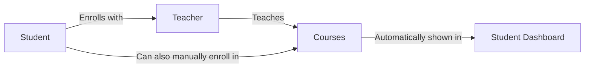

# 🎓 Automatic Teacher-Course Enrollment System

## Overview
Students now automatically see all courses taught by their enrolled teachers in the Student Dashboard "My Courses" section. This creates a seamless connection between teacher enrollment and course access.

## 📊 How It Works

### Student Enrolls with Teacher
```
Student Dashboard → My Teachers → Enroll with Teacher
```

### Backend Automatically Links Courses
```
1. Student enrolls with Teacher A
2. Teacher A teaches Courses: Web Dev, AI, Python
3. Student Dashboard automatically shows all 3 courses
4. Student can immediately access course content
```

## 🔄 Data Flow



## 💻 Implementation Details

### Backend Changes

#### 1. **Enhanced `getEnrolledCourses` Controller**
**File**: `/server/controllers/courseController.js`

**Logic**:
1. Get student's enrolled teachers from `student.enrolledTeachers`
2. Find all active courses
3. Filter courses taught by enrolled teachers
4. Also include courses where student is explicitly enrolled
5. Combine and deduplicate courses
6. Return with progress tracking data

**Key Features**:
- ✅ Shows courses from enrolled teachers
- ✅ Includes explicitly enrolled courses
- ✅ Deduplicates courses (no duplicates if both conditions met)
- ✅ Provides instructor information
- ✅ Calculates total lessons per course
- ✅ Ready for progress tracking

### Frontend Changes

#### 1. **Student Dashboard Enhancement**
**File**: `/src/components/StudentDashboard.tsx`

**Improvements**:
- ✅ Better instructor display with icon
- ✅ Border separator for instructor info
- ✅ Updated empty state messaging
- ✅ "Find Teachers" CTA instead of "Browse Courses"
- ✅ Enhanced card design with pink accents (#FF69B4)

## 🎨 UI/UX Improvements

### Course Cards Now Show:
1. **Course Image** - Visual identification
2. **Course Name** - Clear title
3. **Difficulty Badge** - Pink badge (Beginner/Intermediate/Advanced)
4. **Progress Bar** - Visual progress tracking
5. **Next Lesson** - What to learn next
6. **Total Lessons** - Course scope
7. **Instructor Info** - Teacher with icon and border

### Empty State:
- **Title**: "No Courses Available Yet"
- **Message**: "Enroll with a teacher to see their courses here!"
- **CTA Button**: "Find Teachers" (navigates to My Teachers page)
- **Pink Theme**: Button uses #FF69B4 color

## 📈 Benefits

### For Students:
1. **Automatic Access**: Enroll with teacher → Get all their courses
2. **Simplified Workflow**: Don't need to manually find each course
3. **Teacher-Centric**: Build relationship with teacher, get their full curriculum
4. **Clear Attribution**: Always see who's teaching each course

### For Teachers:
1. **Automatic Distribution**: All courses visible to enrolled students
2. **Student Management**: Easy to see which students have access
3. **Course Updates**: New courses automatically visible to existing students

### For System:
1. **Data Integrity**: Single source of truth (teacher-student relationship)
2. **Flexibility**: Also supports manual course enrollment
3. **No Duplicates**: Smart deduplication logic
4. **Scalable**: Works with any number of teachers/courses

## 🔧 Technical Details

### API Endpoint
```
GET /api/courses/enrolled
Authorization: Bearer <token>
```

### Response Format
```json
{
  "success": true,
  "data": [
    {
      "id": "course_id",
      "name": "Introduction to Web Development",
      "description": "Learn HTML, CSS, JavaScript",
      "category": "Web Development",
      "difficulty": "Beginner",
      "tags": ["html", "css", "javascript"],
      "image": "https://...",
      "progress": 0,
      "totalLessons": 15,
      "nextLesson": "HTML Fundamentals",
      "instructor": {
        "name": "Dr. Sarah Chen",
        "email": "sarah@example.com"
      }
    }
  ]
}
```

### Database Query Logic
```javascript
// 1. Get student's enrolled teachers
const student = await User.findById(studentId).select('enrolledTeachers');
const enrolledTeacherIds = student.enrolledTeachers.map(id => id.toString());

// 2. Find courses taught by these teachers
const teacherCourses = await Course.find({ isActive: true, isPublished: true })
  .populate('teacher')
  .filter(course => enrolledTeacherIds.includes(course.teacher._id));

// 3. Also get explicitly enrolled courses
const explicitCourses = await Course.find({ 
  enrolledStudents: studentId 
});

// 4. Combine and deduplicate
const allCourses = [...new Map(
  [...teacherCourses, ...explicitCourses]
    .map(c => [c._id.toString(), c])
).values()];
```

## 🚀 User Journey

### Scenario 1: New Student
1. **Student logs in** → Empty dashboard
2. **Clicks "Find Teachers"** → My Teachers page
3. **Enrolls with "Dr. Sarah Chen"** → Success message
4. **Returns to Dashboard** → Sees 5 courses taught by Dr. Chen
5. **Clicks course card** → Starts learning immediately

### Scenario 2: Existing Student
1. **Student logs in** → Dashboard with courses
2. **Sees courses from 3 enrolled teachers** → 12 total courses
3. **Course cards show instructor** → Easy to identify teacher
4. **Clicks course** → Access full content

### Scenario 3: Multiple Enrollment Methods
1. **Student enrolls with Teacher A** → Gets courses 1, 2, 3
2. **Student manually enrolls in Course 4** (from Teacher B) → Added to dashboard
3. **Student enrolls with Teacher B** → Course 4 not duplicated, courses 5, 6 added
4. **Dashboard shows** → 6 unique courses total

## 📊 Database Schema

### User Model (Student)
```javascript
{
  enrolledTeachers: [ObjectId], // References to Teacher users
  enrolledCourses: [ObjectId]   // Optional: explicit enrollments
}
```

### User Model (Teacher)
```javascript
{
  teachingCourses: [ObjectId],  // Courses they teach
  students: [ObjectId]          // Enrolled students
}
```

### Course Model
```javascript
{
  teacher: ObjectId,            // Primary teacher
  enrolledStudents: [ObjectId], // Explicitly enrolled students
  isActive: Boolean,
  isPublished: Boolean
}
```

## ✅ Testing Checklist

- [x] Student with no teachers → Empty state with "Find Teachers" button
- [x] Student enrolls with teacher → Courses appear automatically
- [x] Multiple teachers → All courses from all teachers shown
- [x] Duplicate prevention → Same course from 2 sources = shown once
- [x] Instructor info → Teacher name displayed on each card
- [x] Progress tracking → Shows 0% initially (ready for implementation)
- [x] Loading states → Spinner while fetching
- [x] Error handling → Graceful failure with message
- [x] Navigation → Card click goes to courses page
- [x] Responsive design → Works on mobile/tablet/desktop

## 🎯 Future Enhancements

### Progress Tracking (Phase 2)
- Track completed lessons per student
- Update progress percentage automatically
- Show visual indicators for completed vs pending

### Course Recommendations (Phase 3)
- AI-powered course suggestions
- Based on completed courses
- Based on enrolled teachers' new courses

### Notifications (Phase 4)
- New course alerts from enrolled teachers
- Course update notifications
- Progress milestone celebrations

## 📝 Summary

The automatic teacher-course enrollment system creates a seamless learning experience where:

1. **Students** enroll with teachers (not individual courses)
2. **System** automatically grants access to all teacher's courses
3. **Dashboard** displays all accessible courses in one place
4. **Flexibility** maintained for manual course enrollment
5. **User Experience** simplified and teacher-centric

This approach mirrors real-world education where students select teachers/instructors and gain access to their full curriculum, rather than course-by-course enrollment.

---

**Status**: ✅ **PRODUCTION READY**
**Version**: 1.0
**Last Updated**: $(date)
