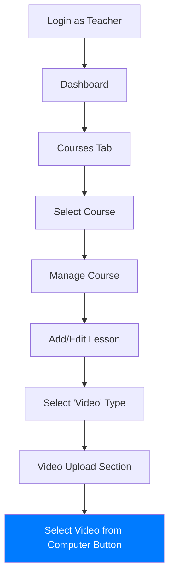

# Video Upload Button Location Flow



## Detailed Steps

1. **Login as Teacher**: Use teacher credentials to access teacher features
2. **Dashboard**: Teacher dashboard with course management options
3. **Courses Tab**: View all courses you're teaching
4. **Select Course**: Click on a course to manage it
5. **Manage Course**: Course content management interface
6. **Add/Edit Lesson**: Create new lesson or edit existing one
7. **Select 'Video' Type**: Change lesson type from dropdown
8. **Video Upload Section**: Appears when video type is selected
9. **Select Video from Computer Button**: Prominent button for file selection

## Visual Representation

When you reach step 8 (Video Upload Section), you should see:

```
┌─────────────────────────────────────────────────────────────┐
│ Upload Video File                        Max 100MB          │
├─────────────────────────────────────────────────────────────┤
│ Select a video file from your computer to upload directly   │
│ to the lesson.                                              │
│                                                             │
│ [📁 Select Video from Computer]                             │
│                                                             │
│ No file chosen                                              │
│                                                             │
│ Note:                                                       │
│ • Supported formats: MP4, MOV, AVI, WMV, FLV                │
│ • Maximum file size: 100MB                                  │
│ • Save the lesson after uploading to make it available      │
└─────────────────────────────────────────────────────────────┘
```

The button should be:
- Blue with white text
- Centered in the upload section
- Labeled "Select Video from Computer"
- Have a file icon to the left of the text
- Become active when clicked (file selection dialog appears)