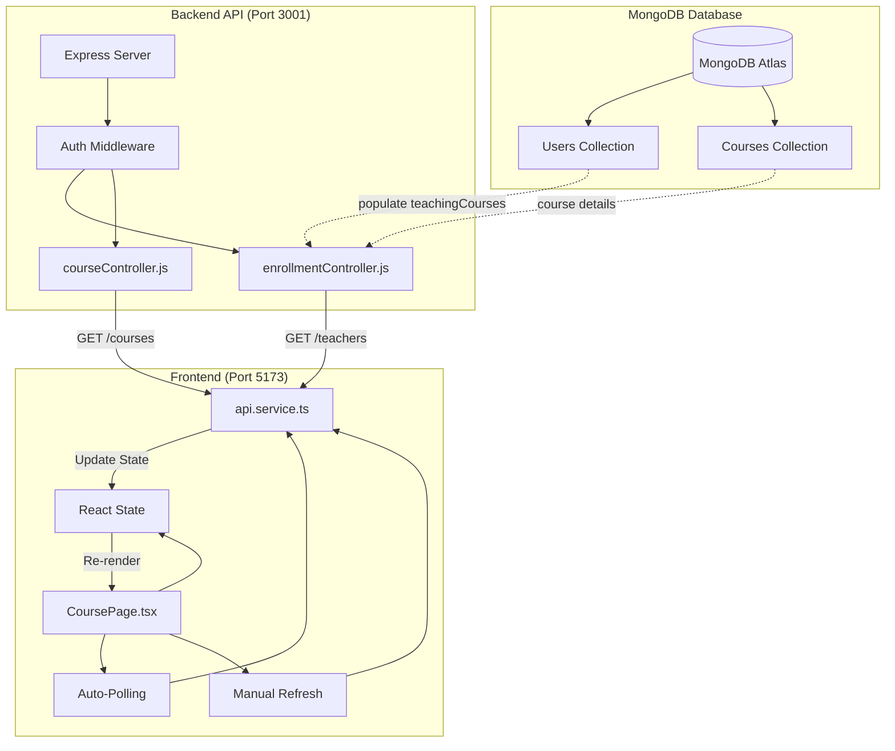
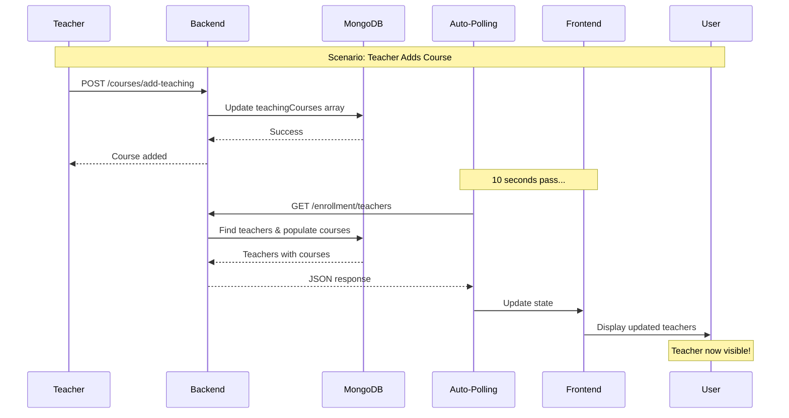
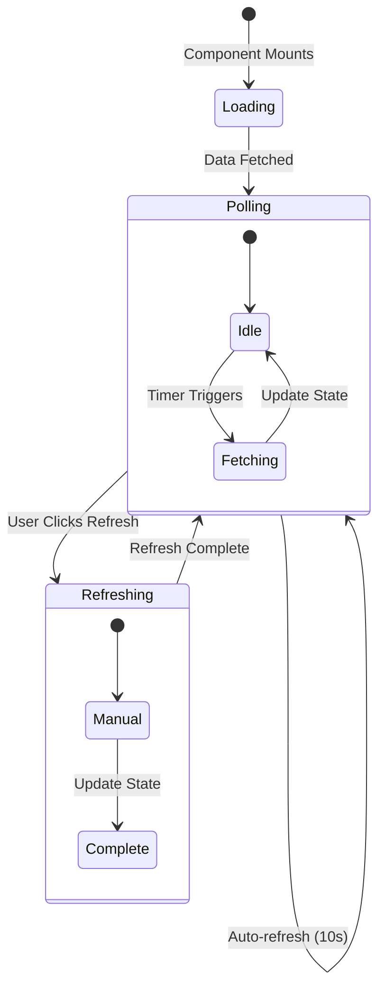
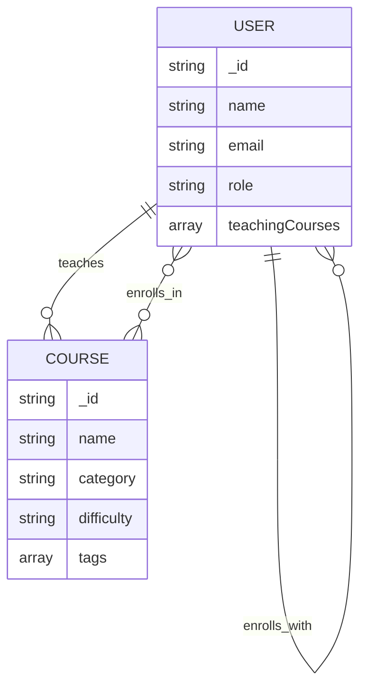
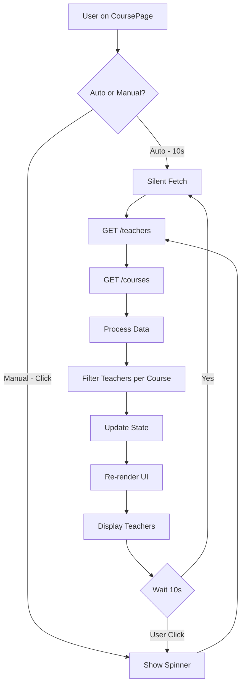
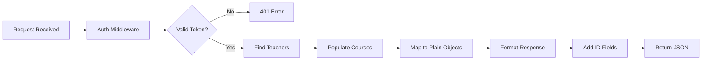
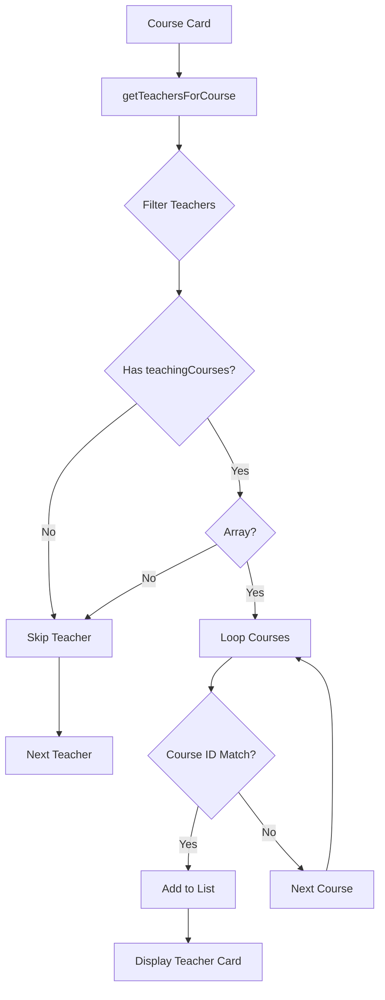
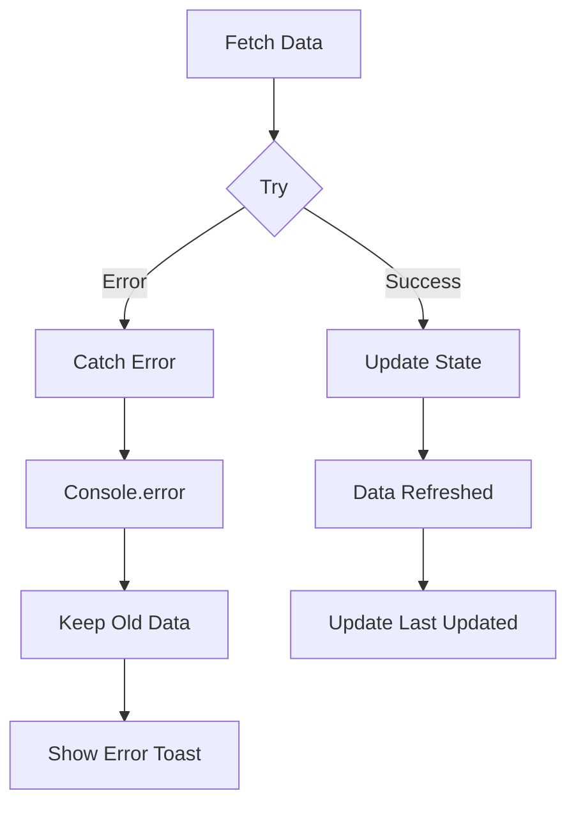
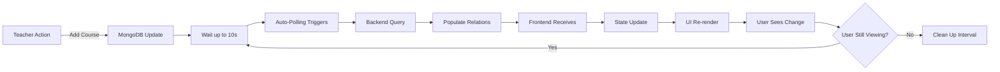
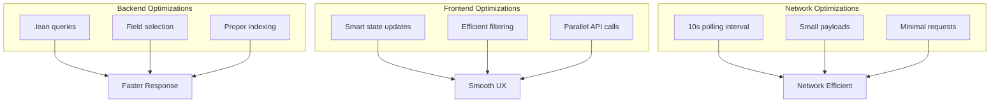

# Real-Time Teacher Updates - Visual Flow Diagram

## System Architecture



## Data Flow Timeline



## Component State Flow



## Teacher-Course Relationship



## Frontend Component Lifecycle

```mermaid
graph LR
    A[Mount] --> B[useEffect]
    B --> C[fetchData]
    C --> D[Set Interval]
    D --> E[Poll Every 10s]
    E --> C
    
    F[User Clicks Refresh] --> G[fetchData(true)]
    G --> H[setRefreshing(true)]
    H --> I[API Call]
    I --> J[Update State]
    J --> K[setRefreshing(false)]
    
    L[Unmount] --> M[clearInterval]
```

## API Request Flow



## Backend Data Processing



## Teacher Display Logic



## Error Handling Flow



## Real-Time Update Cycle



## Performance Optimization Points



---

## Key Takeaways

### 1. **Automatic Updates**
- Polling every 10 seconds ensures near real-time data
- Silent updates don't disrupt user experience
- Clean up on component unmount prevents memory leaks

### 2. **Manual Refresh**
- User can force immediate update
- Clear visual feedback with spinner
- Disabled state prevents multiple simultaneous requests

### 3. **Data Consistency**
- Backend populates full course details
- IDs mapped consistently (both `id` and `_id`)
- Frontend handles both string and object references

### 4. **Performance**
- MongoDB `.lean()` reduces query overhead
- Parallel API calls reduce total wait time
- Efficient filtering in O(n) time complexity

### 5. **User Experience**
- Loading states provide feedback
- Timestamp shows data freshness
- Smooth transitions maintain polish

---

## Visual Reference

### Before Implementation
```
[Course Card]
├── Course Info
├── Tags
├── Enrollment Count
└── [No Teachers] ❌
```

### After Implementation
```
[Course Card]
├── Course Info
├── Tags
├── Enrollment Count
└── Teachers Section ✅
    ├── Teacher Count
    ├── Teacher 1 (name, email)
    ├── Teacher 2 (name, email)
    └── [Auto-refreshes every 10s]
```

### Header Elements
```
[Page Header]
├── Title: "All Courses 📚"
├── Subtitle: "Browse and explore..."
├── Last Updated: "10:30:45 AM" ✅
└── [Refresh Button] ✅
```

---

**Status:** ✅ Complete  
**Real-time Updates:** Active  
**Polling Interval:** 10 seconds  
**Performance:** Optimized
